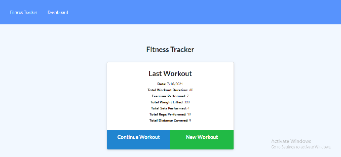

# Unit 18 Nosql Homework: Workout Tracker


## Description

This is the homework for Workout Tracker.

## Link for the repo
[My homework]( https://workout-tracker-ek.herokuapp.com/)

## Screenshot for the application



## Video for the application


## User Story
```md
AS a user
 I WANT to be able to view create and track daily workouts. 
 I WANT to be able to log multiple exercises in a workout on a given day. 
 I SHOULD also be able to track the name, type, weight, sets, reps, and 
 duration of exercise. 
 IF the exercise is a cardio exercise, I should be able to track my distance traveled.

```

## Acceptance Criteria
```md
WHEN the user loads the page, they should be given the option to create a new
 workout or continue with their last workout.

THE USER should be able to:

ADD exercises to the most recent workout plan.

ADD new exercises to a new workout plan.

VIEW the combined weight of multiple exercises from the past seven workouts 
on the stats page.

VIEW the total duration of each workout from the past seven workouts on the stats page.

```